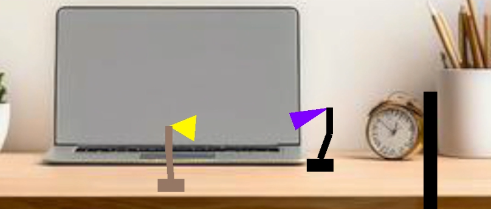

# Unity Application Report: Character Setup and Articulated Motion

## Introduction

This project documents the development of a Unity application featuring a custom character (QUT Jr), using C# scripts to control articulated motion. The project builds on concepts from Luxo Jr. and introduces walking, nodding, jumping, and user-controlled behaviors in a simple 3D environment.

## Program Design

The application is developed in Unity with custom C# scripts to control the movement and articulation of the QUT Jr character. The structure involves using limbs and hierarchical components, inspired by the Luxo Jr. animation, to achieve smooth motion and interaction. This report outlines tasks ranging from simple articulation to two-player mode.

### Project Structure

- **Scenes**: Contains the main scene file.
- **Scripts**: Includes custom C# scripts for controlling movement, articulation, and camera behavior.

### Custom Classes and Scripts

- **Limb.cs**: Manages the hierarchical components (limbs) of QUT Jr. Each limb has custom rotation and movement logic.
- **Lamp.cs**: Controls the overall behavior of QUT Jr. including walking, nodding, and jumping, as well as user input handling.
- **CameraControl.cs**: Adjusts the camera to focus on both characters during two-player mode.
- **IGB283Transform.cs**: Provides matrix operations for object transformations like rotation, translation, and scaling.
- **Matrix3x3.cs**: Handles low-level matrix operations used by IGB283Transform for transformations.

## Tasks and Features

### Task 1 – character Setup
- A new character, QUT Jr., is created with at least four components (base, upper arm, lower arm, head).
- Components are articulated to mimic natural movement, inspired by the Luxo Jr. animation style.

### Task 2 – Head Wobble/Nod
- QUT Jr.'s head continually nods using C# scripts, controlled by rotations applied to its limb components. The motion is based on a simple rotation function applied to the upper and lower arms.

### Task 3 – Walking Motion
- QUT Jr. walks left and right within specified bounds. The movement is continuous unless interrupted by user input or other conditions.

### Task 4 – Combined Articulation (Head Wobble + Walking)
- The character simultaneously walks and nods, achieved by traversing the hierarchy of limbs and applying both translation (for walking) and rotation (for nodding).

### Task 5 – Jumping
- QUT Jr. can jump continuously, moving up and down vertically. A forward-jumping motion is also implemented with combined upward and forward translation.

### Task 6 – character Controls
- The user can control QUT Jr. (QUT Sr.) with keyboard inputs:
  - `A` (`←`): Move left.
  - `D` (`→`): Move right.
  - `W` (`↑`): Immediate jump.
  - `S` (`↓`): Long jump.
  - `Z` (`Y`): Collapse and temporarily disable controls, followed by the character standing back up.

### Task 7 – Two Player Mode
- Two characters are implemented, with distinct colors and appearances.
- Each character has independent controls.
- A camera system adjusts to keep both characters in view.

## User Instructions

1. **Run the Scene**: Open the main scene in Unity and press Play.
2. **Control QUT Jr. (QUT Sr.)**: Use `A` (`←`) and `D` (`→`) to move left or right, `W` (`↑`) to jump, and `S` (`↓`) for a long jump. Press `Z` (`Y`) to collapse and observe QUT Jr.'s (QUT Sr.'s) recovery.
3. **Two Player Mode**: Control both characters with the respective keys, and watch as the camera adjusts dynamically to keep both in view.
4. **Jump and Move**: Observe the character's smooth articulation as it walks, nods, jumps, and collapses.

## Visual Preview

## Conclusion

This Unity application demonstrates articulated motion, user input control, and interaction between two characters. Each task builds on fundamental animation principles and matrix transformations to create a dynamic and interactive 3D scene.

## Video Preview

[YouTube Video](https://www.youtube.com/watch?v=WSpvBiwzEg0)
